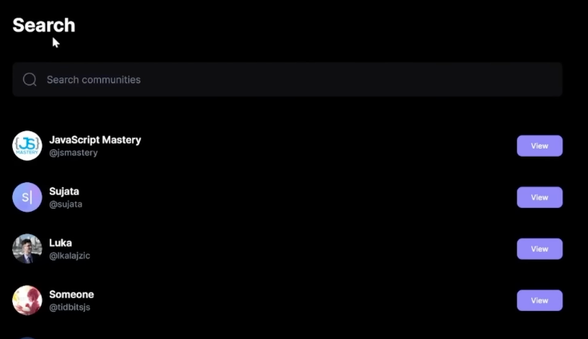
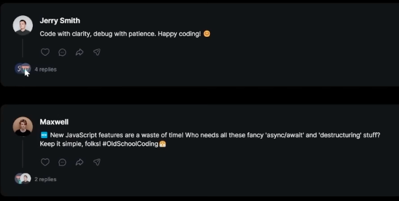
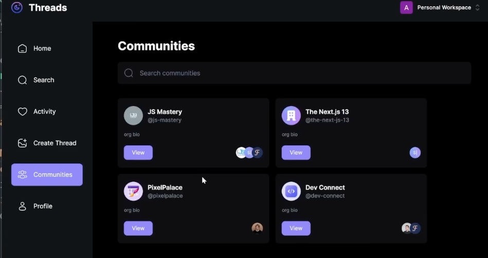
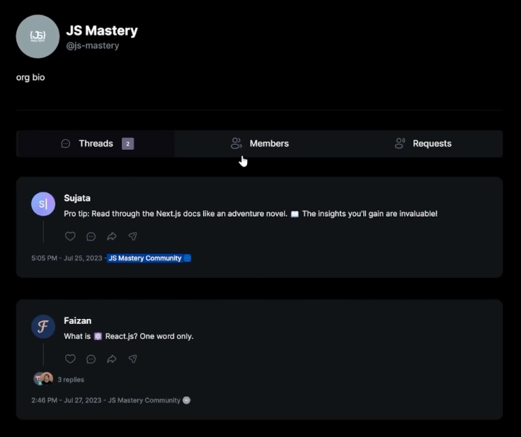

# Meta Threads Clone

## Getting Started

Run the development server:
```bash
npm run dev
```

Open [http://localhost:3000](http://localhost:3000) with your browser to see Threads


## Note
- Should comment (as it's also a thread) be clean up once the original thread is deleted? (even tho now it does not have the delete functionality yet)
- user2: pobije2430@ikuromi.com


## TODO 

- [] Search bar in Search page & Communities page

- [] Comment user icon and total replies



- [] Reuse the profile page and ThreadCard
- [] Community creation would be through Clerk, and use webhooks between our app and clerk to make thing work, also use svix for webhooks verification
- [] Need to add a webhook endpoint in Clerk

- [] check https://github.com/adrianhajdin/threads

- [] Read https://gist.github.com/adrianhajdin/060e4c9d3d8d4274b7669e260dbbcc8e
    
    - [comm_1](app/api/webhook/clerk/route.ts), [comm_2](lib/models/community.model.ts), [comm_3](lib/actions/thread.actions.ts), [comm_4](lib/actions/user.actions.ts), [comm_5](components/cards/CommunityCard.tsx)
    - similiar to others part, except it's driven by webhook
    - Qn: When webhook come in, how does app know to use route.ts? (based on file path? Yes)

Webhook endpoint: https://meta-threads-clone-fzlg0dieb-owen771.vercel.app/api/webhook/clerk

## Auth

- Clerk: a 3rd party provided auth component (login with Github, Google, Email etc.) 

## Layout

- Added topbar
- Sidebar for nav to various page 
    - Topbar (Logo, Your account)
    - Left Sidebar for web, BottomBar for mobile / tablet
        - How come always one of them is showing (i.e BottomBar wont show when LeftSidebar showed, vice versa)
    - Right sidebar (Suggested communities, Suggested users)

## Onboarding 

- [shadcn/ui](https://ui.shadcn.com/docs/components/form): a 3rd party that provided component
    - Generated all codes on /components/ui/
- [Zod](https://zod.dev/): TypeScript-first schema validation with static type inference (no idea what this for)
- Onboarding page (a form) frontend done
- Onboarding page (a form) backend done (uploadthing api + mongoDB)

## Thread (post)

- A textarea for user to create thread post
- Home page fetch thread

## Thread detail page

- Original post
- other user can put comment on original post
- other user can put comment on other comment


## Profile

- User can view its profile as well as others
    - User profile
    - Using shadcn-ui to impl Tabs (Replies, Tagged not impl)
    - If looking at your own profile, you can delete Threads you post (not impl yet)


## Search

- Can see other users and view its profile


## Activity

- Like a notification tab, where allow you to see when somebody commented on your Thread


## Community

- There has many communities, and admin can give user access to it


- Once you're the member community, you can read all of the community Threads


- Also can see the member list of the community

