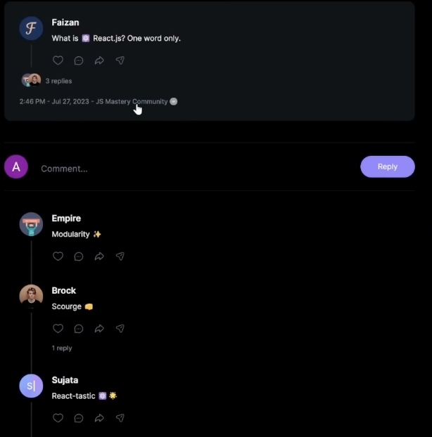

# Meta Threads Clone

## Getting Started

Run the development server:
```bash
npm run dev
```

Open [http://localhost:3000](http://localhost:3000) with your browser to see Threads


## Note
- It depends on MongoDB
- tailwind.config.js, globals.css are provided by the course
- Should comment (as it's also a thread) be clean up once the original thread is deleted? (even tho now it does not have the delete functionality yet)
- user2: pobije2430@ikuromi.com

TODO (not in the video, but in ): 

- Search bar in Search page & Communities page

- Comment user icon and total replies


Useful link:

- Clerk: https://dashboard.clerk.com/apps/app_2aoDgHv5p4XDroHC3pkdN2S1Kf4/instances/ins_2aoDgIIbgFCxU7iGACALPj1YFdn/webhooks
- Tutorial github: https://github.com/adrianhajdin/threads
- Vercel: https://vercel.com/owen771/meta-threads-clone/deployments
- Mongodb: https://cloud.mongodb.com/v2/606fce720eb8f82f81ebdfd1#/clusters

### Auth

- Clerk: a 3rd party provided auth component (login with Github, Google, Email etc.) 

### Layout

- Added topbar
- Sidebar for nav to various page 
    - Topbar (Logo, Your account)
    - Left Sidebar for web, BottomBar for mobile / tablet
        - How come always one of them is showing (i.e BottomBar wont show when LeftSidebar showed, vice versa)
    - Right sidebar (Suggested communities, Suggested users)

### Onboarding 

- [shadcn/ui](https://ui.shadcn.com/docs/components/form): a 3rd party that provided component
    - Generated all codes on /components/ui/
- [Zod](https://zod.dev/): TypeScript-first schema validation with static type inference (no idea what this for)
- Onboarding page (a form) frontend done
- Onboarding page (a form) backend done (uploadthing api + mongoDB)

### Thread (post)

- A textarea for user to create thread post
- Home page fetch thread

#### Thread detail page

- Original post
- other user can put comment on original post
- other user can put comment on other comment



## Profile

- User can view its profile as well as others
    - User profile
    - Using shadcn-ui to impl Tabs (Replies, Tagged not impl)
    - If looking at your own profile, you can delete Threads you post (not impl yet)


## Search

- Can see other users and view its profile


## Activity

- Like a notification tab, where allow you to see when somebody commented on your Thread


## Community

- There has many communities, and admin can give user access to it


- Once you're the member community, you can read all of the community Threads


- Also can see the member list of the community


## Auth

- Clerk: a 3rd party provided auth component (login with Github, Google, Email etc.) 

Website: https://meta-threads-clone-fzlg0dieb-owen771.vercel.app/
Webhook endpoint: https://meta-threads-clone-fzlg0dieb-owen771.vercel.app/api/webhook/clerk
